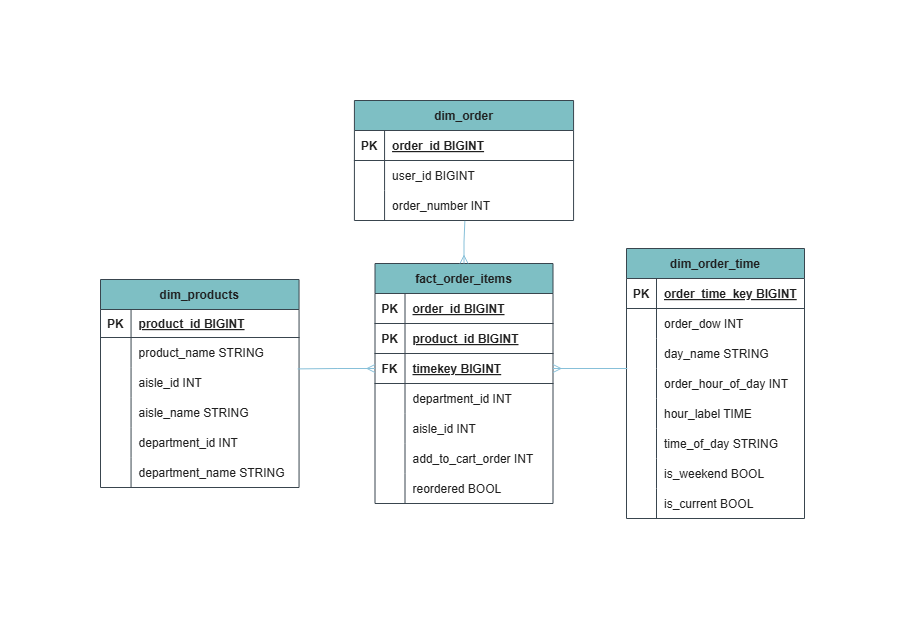

# 🛒 Instacart Data Pipeline

> Turning raw grocery-order data into clean, reliable, analytics-ready tables.

This team project uses **Databricks SQL** and **Delta Lake** to build an end-to-end data pipeline based on the Medallion Architecture.



## 🔄 How the data moves

**Source files → Bronze → Silver → Gold → Analytics**

| Layer | Purpose |
|---|---|
| 🥉 **Bronze** | Ingests raw Instacart data and keeps source-level records |
| 🥈 **Silver** | Cleans, standardizes, validates, and combines related datasets |
| 🥇 **Gold** | Builds fact and dimension tables for business analysis |
| 📊 **Analytics** | Answers business questions through reusable SQL views and notebooks |

## 🎯 What this project demonstrates

- A structured **ETL pipeline** in Databricks
- **Delta tables** across Bronze, Silver, and Gold layers
- Clean and reusable **SQL transformations**
- A **star schema** for faster and simpler reporting
- Data-quality checks for nulls, duplicates, keys, and row counts
- Audit-friendly metadata and repeatable pipeline runs

## 🧱 Gold data model

The analytics layer is organized around:

- **Fact:** `fact_order_items`
- **Dimensions:** `dim_order`, `dim_order_time`, and `dim_products`

Together, these tables support questions such as:

- Which products and departments are ordered most?
- What days and hours have the highest ordering activity?
- How often do customers reorder products?

See the full [star schema](docs/star_schema.md) and [data dictionary](docs/data_dictionary.md).

## 📁 Repository guide

```text
instacart-pipeline/
├── src/
│   ├── sql/
│   │   ├── 00_setup/           # Schemas, source inspection and audit
│   │   ├── 01_bronze_ingest/   # Raw data ingestion
│   │   ├── 02_silver_clean/    # Cleaning and standardization
│   │   ├── 03_gold_model/      # Fact and dimension tables
│   │   └── 05_analytics/       # Business views and analysis
│   └── images/                 # Project resources 
├── tests/                      # Source, clean, mart, and query checks
├── docs/                       # Architecture and model documentation
```

## ▶️ Run the pipeline

Run the folders in this order:

1. `00_setup`
2. `01_bronze_ingest`
3. `02_silver_clean`
4. `03_gold_model`
5. `05_analytics`
6. `tests`

> Source paths are intentionally excluded from the repository. Configure them securely in Databricks before running ingestion.

## ✅ Quality checks

Before results are used for reporting, the tests verify:

- Primary keys are complete and unique
- Foreign keys match their dimension tables
- Required audit metadata is present
- Re-running the pipeline does not create duplicates
- Business queries return valid results
  
## 📚 Documentation

- [Architecture](docs/architecture_diagram.md)
- [Data dictionary](docs/data_dictionary.md)
- [Star schema](docs/star_schema.md)
- [Project assumptions](docs/assumptions.md)

---

Built as a collaborative **FTW Data Engineering** project. View the repository’s [contributors](https://github.com/ItsYangCoder/instacart-pipeline/graphs/contributors).


---

## 🔁 CI/CD Automation

GitHub Actions now validates and deploys the pipeline through separate development and production environments.

- Pull requests to `main` or `develop` run dependency-free checks for SQL, Databricks notebooks, job references, credentials, destructive SQL, and oversized/raw data files.
- Pushes to `develop` deploy the exact commit to the `development` Databricks environment and use the `instacart-pipeline-development` job.
- Pushes to `main` deploy the exact commit to the protected `production` environment and use the `instacart-pipeline-production` job.
- The job runs setup, Bronze ingestion, Silver cleaning, Gold modeling, and the release quality gate in dependency order.
- Documentation-only changes do not start a compute run. Pull requests collapse to the newest validation run, while environment deployments are serialized.

### Required GitHub configuration

Create two GitHub Environments named `development` and `production`. Add the same three secret names to each environment with environment-specific Databricks values:

- `DATABRICKS_HOST`
- `DATABRICKS_TOKEN`
- `DATABRICKS_WAREHOUSE_ID`

Configure required reviewers on the `production` environment if production releases need approval. The Databricks token should be limited to SQL execution and Jobs API operations.

The workflow does not store tokens, warehouse IDs, raw CSV files, or Databricks workspace copies in the repository.
